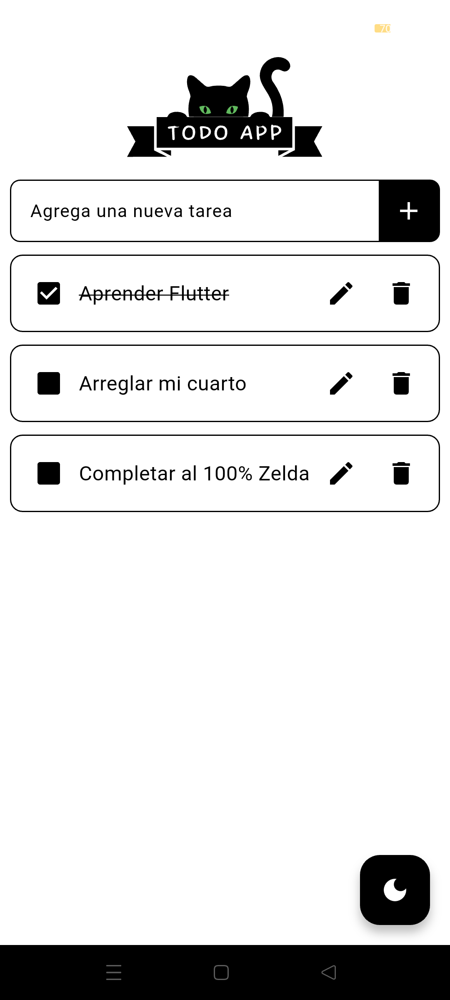
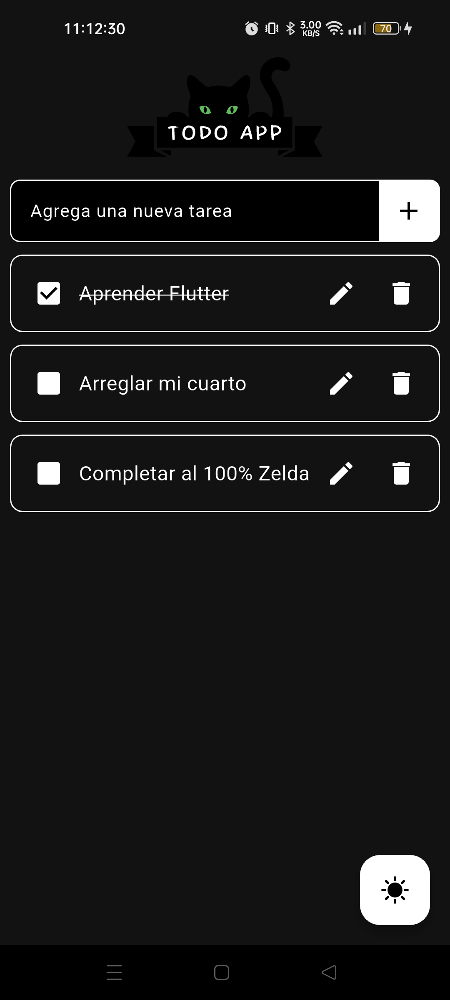

# 📝 Todo App

Una aplicación de lista de tareas construida con **Flutter** para gestionar tus actividades diarias. Puedes agregar, editar, eliminar y marcar tareas como completadas. La interfaz es limpia y moderna.

## ✨ Características

- Añadir nuevas tareas
- Editar tareas existentes
- Marcar tareas como completadas
- Eliminar tareas
- UI elegante con Flutter
- Modo Oscuro
- Guardado local de datos (Próximamente)

## 📱 Capturas de pantalla

<p align="center">
  
  
  

</p>

## 🚀 Instalación

1. Clona el repositorio:
   ```bash
   https://github.com/FranciscoMelen10/Todo.git
   ```
